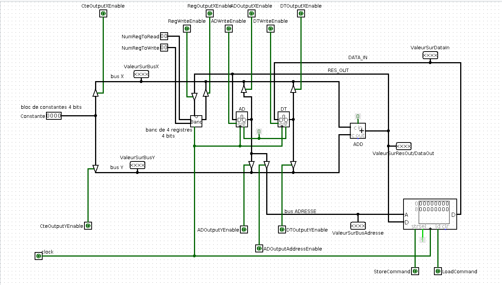
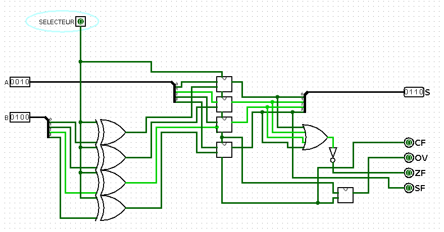

# 2I004
Computer architecture course Sorbonne university

## Subject Covered
	
	- mips Assembly programming
	- Cpu Circuit simulation
	- Registers
	- Adders
	- Multiplexers
	- FlipFlops

### fonctional minimalistic architecture

basic architecture to read write from memory, and execute commands

### full adder

Adder circuit in C2 base, performs both addition and subtraction
with flags for overflow, zero

